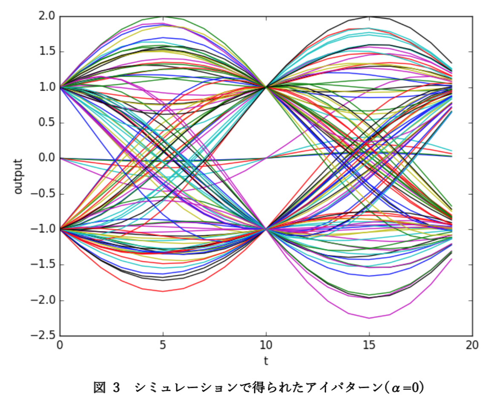
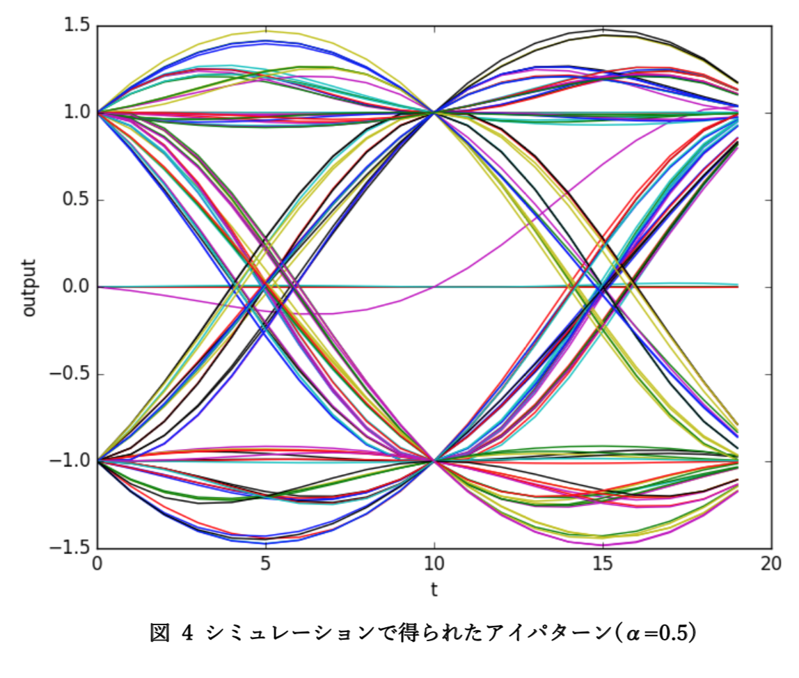
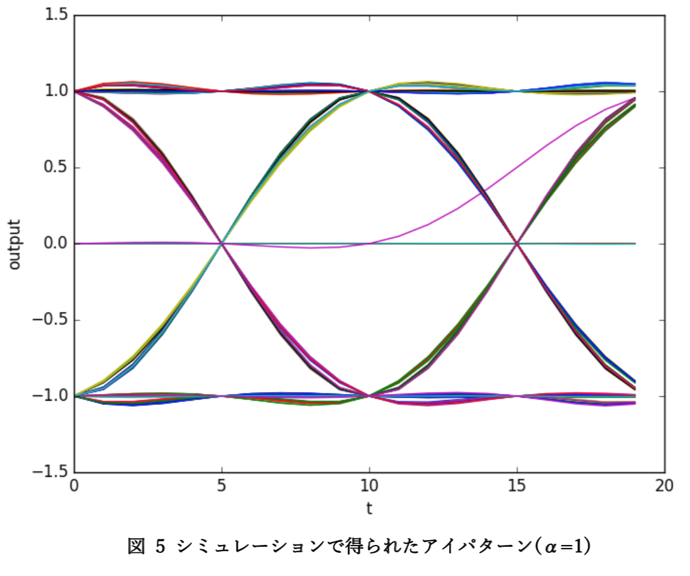

# Eye-pattern simulator
This is an [Eye-pattern](https://en.wikipedia.org/wiki/Eye_pattern) simulator.  

Given α (roll-off coefficient), it outputs eye-pattern (or also called eye-diagram).






## Usage
It requires `matplotlib` and `numpy`. 
```
$ python3 eye-pattern.py
```

## comment
アイダイアグラム(アイパターン)のシミュレータ。CSVで出力じゃなくてプロットしてくれる。ローカルリポジトリがどっかいったorそもそもVCS使ってなかったので履歴なし。  

必死こいてロールオフ係数とか勉強したけど、無線関係の知識を使わずに1年経ったら忘れた。
